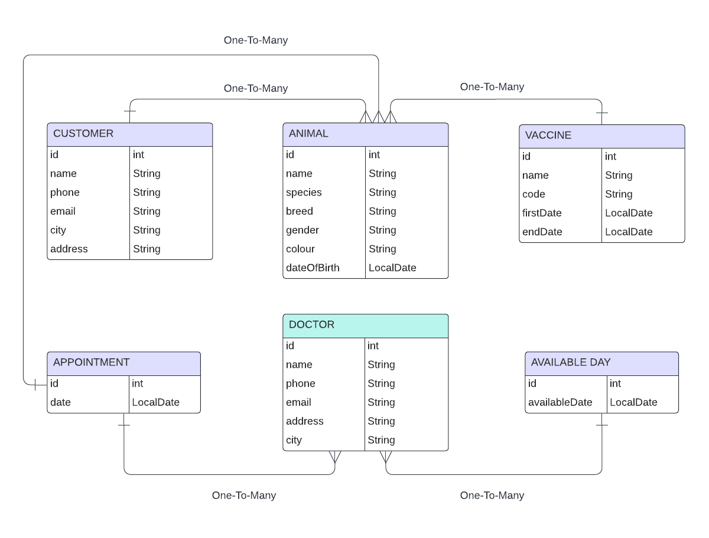

                                          VETERINER API

Java Maven, Spring Boot ve Postgresql Teknolojileri kullanılarak Veteriner Yönetim Rest Api Yapılması Amaçlanmıştır.

  Başlıca Özellikler
-
- Doktor ekleme, güncelleme, görüntüleme ve silme
- Müşteri ekleme, güncelleme, görüntüleme ve silme
- Müşterilere ait hayvanları ekleme, güncelleme, görüntüleme ve silme
- Doktorların müsait olduğu tarihi ekleme
- Hayvan ekleme, güncelleme, görüntüleme ve silme
- Hayvanların aşı tarihlerini ekleme ve görüntüleme
- Randevu oluşturma

##
                                         UML DIAGRAM

##

Api Endpoint'leri
-
- getById : http://localhost:8080/v1/animals/1 : Hayvan görüntüleme
- update : http://localhost:8080/v1/animals : Hayvan güncelleme
- delete : http://localhost:8080/v1/animals/5 : Hayvan silme
- save : http://localhost:8080/v1/animals : Yeni Hayvan ekleme
- getCustomerById : http://localhost:8080/v1/animals/customer-by-id/1 : Customer'a göre Hayvan görüntüleme
- getCustomerByName : http://localhost:8080/v1/animals/customer-by-name?name=test : Customer ismine göre Hayvan görüntüleme
- getByName : http://localhost:8080/v1/animals/animal-by-name?name=test : İsme göre Hayvan görüntüleme
- getAll : http://localhost:8080/v1/animals : Bütün Hayvanları görüntüleme
- save : http://localhost:8080/v1/customers : Yeni Customer ekleme
- delete : http://localhost:8080/v1/customers/1 : Customer silme
- update : http://localhost:8080/v1/customers : Customer güncelleme
- getAll : http://localhost:8080/v1/customers : Bütün Customerları görüntüleme
- getByName : http://localhost:8080/v1/customers/customer-by-name?name=test : İsme göre Customer görüntüleme
- getByAnimalId : http://localhost:8080/v1/customers/customer-by-animal-id/1 : Hayvana göre Customer görüntüleme
- getById : http://localhost:8080/v1/customers/1 : Customer görüntüleme
- save : http://localhost:8080/v1/vaccines : Aşı ekleme
- delete : http://localhost:8080/v1/vaccines/1 : Aşı silme
- getById : http://localhost:8080/v1/vaccines/1 : Aşı görüntüleme
- getByAnimalId : http://localhost:8080/v1/vaccines/animal/1 : Hayvana göre Aşı görüntüleme
- getFindDate : http://localhost:8080/v1/vaccines/find-date?firstDate=2024-01-01&endDate=2024-01-02 : Aşı tarihleri görüntüleme
- update : http://localhost:8080/v1/vaccines : Aşı güncelleme
- getAll : http://localhost:8080/v1/vaccines : Bütün Aşıları görüntüleme
- save : http://localhost:8080/v1/doctors : Yeni Doktor ekleme
- getAll : http://localhost:8080/v1/doctors : Bütün Dokları görüntüleme
- getById : http://localhost:8080/v1/doctors/1 : Doktor görüntüleme
- update : http://localhost:8080/v1/doctors : Doktor güncelleme
- delete : http://localhost:8080/v1/doctors/1 : Doktor silme
- save : http://localhost:8080/v1/available_dates : Uygun Tarih ekleme
- update : http://localhost:8080/v1/available_dates : Uygun Tarih güncelleme
- getById : http://localhost:8080/v1/available_dates/1 : Uygun Tarih görüntüleme
- getAll : http://localhost:8080/v1/available_dates : Bütün Uygun Tarihleri görüntüleme
- delete : http://localhost:8080/v1/available_dates/1 : Uygun Tarih silme
- save : http://localhost:8080/v1/appointments : Randevu oluşturma
- getByDateByDoctor : http://localhost:8080/v1/appointments/appointments-by-date-by-doctor?startDate=2024-01-01T00:00:00&endDate=2024-01-02T00:00:00&doctorId=1 : Doktora göre Randevu görüntüleme
- getByDateByAnimal : http://localhost:8080/v1/appointments/appointments-by-date-by-animal?startDate=2024-01-01T00:00:00&endDate=2024-01-02T00:00:00&animalId=1 : Hayvana göre Randevu görüntüleme
- getById : http://localhost:8080/v1/appointments/1 : Randevu görüntüleme
- update : http://localhost:8080/v1/appointments : Randevu güncelleme
- delete : http://localhost:8080/v1/appointments/1 : Randevu silme
- getAll : http://localhost:8080/v1/appointments : Bütün Randevuları görüntüleme

